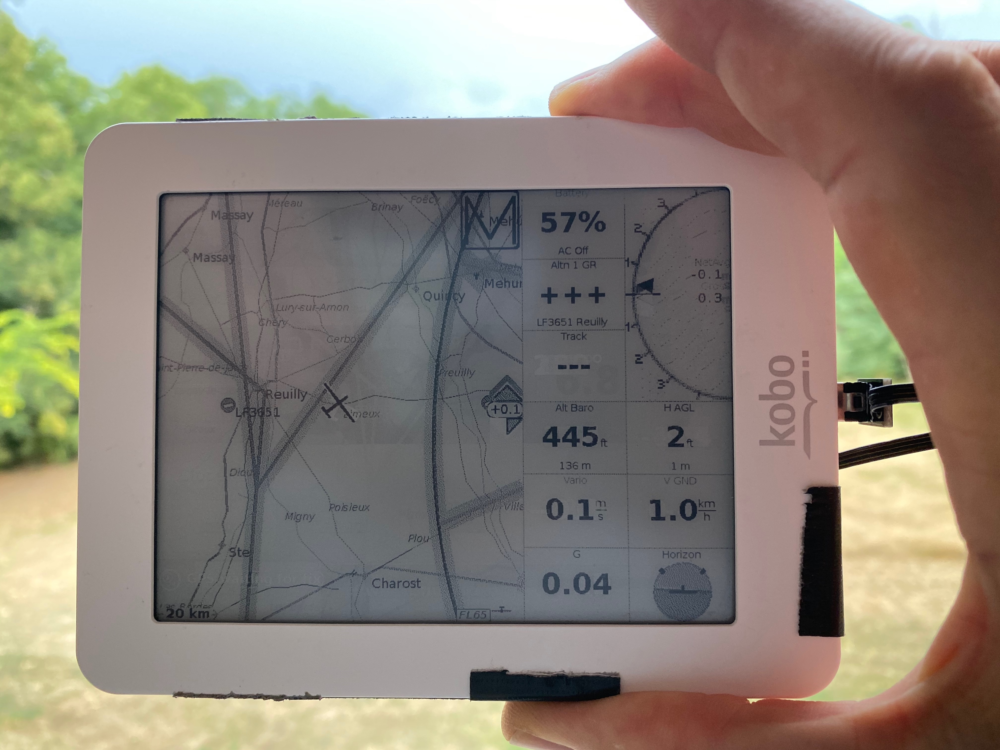

# flybaby
A sensor using esp32, mpu6050 in DMP mode and ms5607 (despite the class names) pressure sensor and GPS, publishing NMEA sentences on serial port. 
I imagine it would work with ESP8266 instead of ESP32 with little changes, with mpu9150 or 9250 instead of mpu6050 with no change at all, and with ms5611 or ms5637 instead of ms5607 with very little changes.

Using platformio with Arduino framework.

This is originially a port of Iain Frew's https://github.com/mwesterm/esp32-vario which itself is a port of Hari Nair's https://github.com/har-in-air/ESP8266_MPU9250_MS5611_VARIO to esp32 and using the DMP functionaility of the 6050 IMU on the GY-86 breakout board.

The majority of the code was some great work by Jeff Rowberg for the mpu6050 library and the i2cdevlib interface, and Hari Nair for the Vario design. The calibration came from  Luis Ródenas. Iain Frew put some glue on various components. I added GPS forwarding and NMEA output.
The plan is to build on it.

After customization (pin-wise), subtle refactoring/adaptation, NMEA interfacing, and calibration I am able to make it work nicely with KoBo mini!

I haven't taken it to fly yet but i can see from driving with it that the vario, accel, horizon, gps speed, altitude all make sense.

## recipe 
1. get the sensor modules and connect them to esp32
   1. MPU6050 ic2 pins SDA 4, SCL 5, INTerrupt 15
   1. MS5607  ic2 pins SDA 4, SCL 5
   1. serial GPS serial pin RX 13 (only this one is needed as we don't send instructions to GPS module)
   1. pull-down or capacitive button on pin 12
   1. audio on pin 17 (still to be tested -- my device does not have audio for the time being)
1. Get a KoBo mini and install XCsoar on it http://gethighstayhigh.co.uk/kobo-self-build/
1. Interface your sensor with serial either 
   1. with a micro-usb <-> micro-usb in which case you will need to provide 
   1. directly soldering on the kobo serial port (http://gethighstayhigh.co.uk/kobo-self-build/)
1. optionally remove the battery from KoBo and put another on in place -- i soldered 3 18650 Li-Ion outside the kobo for exxxxtended autonomy
